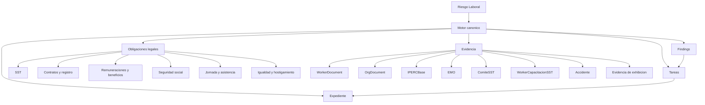

# Riesgo Laboral - Super Prompt y Analisis Integral

Fecha de analisis: 2026-05-24
Producto: COMPLY360 / SaaS de compliance laboral peruano
Alcance: seccion Riesgo Laboral, Centro SUNAFIL, SST, SUNAFIL-Ready, diagnostico, simulacro, inspecciones, agentes y motores de riesgo.

> Nota: este documento no reemplaza revision legal especializada. Su objetivo es convertir la revision de producto, datos, UX y arquitectura en un plan accionable para mejorar la SaaS.

## 1. Super Prompt Maestro

Usar este prompt cuando se quiera encargar a una IA, equipo de producto, consultor legal, arquitecto de software o auditor interno un analisis profundo de la seccion Riesgo Laboral.

```text
Actua como un equipo senior integrado por:
1. Product Manager B2B SaaS para compliance laboral peruano.
2. Abogado laboralista peruano especializado en fiscalizacion SUNAFIL, seguridad y salud en el trabajo, relaciones laborales, seguridad social, igualdad remunerativa y hostigamiento sexual laboral.
3. Arquitecto de software para Next.js, Prisma, Supabase/Postgres y sistemas multi-tenant.
4. UX researcher para herramientas operativas B2B usadas por RR.HH., legal, gerencia y responsables SST.
5. Auditor de datos y QA especializado en motores de scoring, evidencia documental y trazabilidad.

Contexto del producto:
- La SaaS se llama COMPLY360 y atiende empresas peruanas.
- El usuario objetivo quiere saber: que riesgos laborales tengo, cuanto me puede costar, que debo hacer hoy, que evidencia debo guardar, quien es responsable, cual es el plazo y como me preparo ante SUNAFIL.
- La seccion Riesgo Laboral convive con modulos de Centro SUNAFIL, SST, SUNAFIL-Ready, Diagnostico, Simulacro, Casilla SUNAFIL, Inspeccion en vivo, Alertas, Tareas, Organigrama, Trabajadores, Documentos, Capacitaciones e Igualdad salarial.
- El objetivo no es solo "mostrar dashboards", sino construir un flujo preventivo que lleve al cliente desde deteccion de brecha hasta subsanacion con evidencia y expediente exportable.

Fuentes y reglas de trabajo:
- Verifica la normativa vigente en fuentes oficiales peruanas antes de afirmar obligaciones, montos o plazos.
- Usa como fuentes minimas: Ley 29783, D.S. 005-2012-TR, D.S. 019-2006-TR y modificatorias aplicables, valor UIT vigente, RMV vigente, lineamientos SUNAFIL/MTPE y normativa especifica de SCTR, hostigamiento, igualdad salarial, jornada, planilla y beneficios sociales.
- No inventes base legal. Si algo no esta verificado, marcalo como "requiere validacion legal".
- Distingue entre riesgo legal real, proxy tecnico, supuesto de producto y limitacion de datos.
- Cruza el analisis con el codigo, base de datos, APIs, UI, tests, navegacion y estados reales del producto.

Entrega obligatoria:
1. Resumen ejecutivo de 1 pagina: situacion actual, problema central y decision recomendada.
2. Mapa funcional: todas las pantallas, APIs, motores, tablas y jobs que alimentan Riesgo Laboral.
3. Matriz normativa-producto:
   - obligacion
   - base legal
   - dato necesario
   - fuente de dato actual en la SaaS
   - brecha actual
   - evidencia esperada
   - responsable sugerido
   - prioridad
4. Auditoria de motores:
   - risk-scanner
   - risk-monitor
   - sunafil-ready
   - sst-score
   - auto-evaluator
   - simulacro-engine
   - alert/calendar engine
   - expediente SUNAFIL
   Identifica duplicidad, contradicciones, datos obsoletos, heuristicas debiles y falsos positivos/negativos.
5. Auditoria UX:
   - claridad del menu
   - recorrido principal del usuario
   - informacion sobrante
   - CTA faltantes
   - estados vacios
   - experiencia movil
   - lenguaje legal entendible
   - acciones por rol
6. Propuesta de rediseño:
   - nueva arquitectura de informacion
   - nueva pantalla principal Riesgo Laboral
   - tabs o vistas necesarias
   - flujo "detectar -> priorizar -> asignar -> generar evidencia -> cerrar -> exportar"
   - microcopy
   - estados visuales
   - modelo de permisos y responsabilidades
7. Propuesta tecnica:
   - fuente de verdad canonica
   - esquema de datos recomendado
   - API agregadora
   - estrategia de migracion desde motores actuales
   - tests unitarios/integracion/e2e
   - telemetria y metricas de producto
8. Backlog priorizado:
   - P0: correcciones que afectan exactitud legal o confianza.
   - P1: mejoras que hacen usable el flujo principal.
   - P2: capacidades premium diferenciadoras.
   - P3: automatizacion avanzada e IA.
   Cada item debe tener descripcion, archivos probables, criterios de aceptacion, riesgo y estimacion.
9. Lista de "no construir todavia":
   - cosas vistosas pero no esenciales.
   - features que pueden aumentar confusion.
   - automatizaciones que requieren datos que aun no existen.
10. Resultado final:
   - decision recomendada.
   - primeros 10 commits sugeridos.
   - demo esperada despues de implementar.

Formato de respuesta:
- Escribe en español claro para founders y equipo tecnico.
- Separa hallazgos de recomendaciones.
- Prioriza exactitud, accionabilidad y simplicidad.
- Usa tablas cuando ayuden.
- Cita fuentes oficiales con enlaces.
- Incluye supuestos y riesgos residuales.
```

## 2. Diagnostico Ejecutivo

La seccion Riesgo Laboral ya tiene una base potente, pero esta fragmentada. Hay un Centro SUNAFIL con narrativa fuerte, un modulo SST avanzado, SUNAFIL-Ready con catalogo de 28 documentos, diagnostico, simulacro, inspeccion en vivo, tareas, evidencia y expediente exportable. El problema no es falta de features; el problema es que varias piezas calculan cosas parecidas desde fuentes de datos distintas.

La decision recomendada es construir un "Motor Canonico de Riesgo Laboral" y hacer que la UI de Riesgo Laboral sea la cabina principal. SST debe seguir existiendo como modulo operativo especializado, pero debe alimentar el riesgo laboral, no competir con el. SUNAFIL-Ready debe convertirse en una vista de evidencia dentro del mismo flujo, no en una checklist aislada.

La promesa del producto deberia ser:

> "Te digo tu riesgo laboral real, lo priorizo por multa y urgencia, te digo exactamente que evidencia falta, te asigno tareas y te preparo un expediente defendible ante SUNAFIL."

## 3. Mapa Actual de Producto

### Navegacion

Hallazgos relevantes:

- El hub `Riesgo Laboral` existe en `src/lib/constants.ts` y apunta a `/dashboard/centro-sunafil`.
- El hub `SST` existe por separado y apunta a `/dashboard/sst`.
- `SUNAFIL-Ready · 28 docs` esta en el hub `Contratos & Docs`, no en `Riesgo Laboral`.
- Rutas legacy como `/dashboard/riesgo-sunafil`, `/dashboard/radar`, `/dashboard/diagnostico`, `/dashboard/simulacro` e `/dashboard/inspeccion-en-vivo` se resuelven como riesgo, pero no todas aparecen claramente en el menu principal.
- El directorio `src/app/dashboard/riesgo-sunafil` existe pero esta vacio. Eso deja una señal de arquitectura incompleta.

Lectura de producto:

- El usuario ve "Riesgo Laboral", "Centro SUNAFIL", "SST", "SUNAFIL-Ready", "Diagnostico" y "Simulacro" como cosas separadas.
- Para un usuario de negocio, todas responden a la misma pregunta: "Estoy en riesgo o no?".
- Esto genera dispersion cognitiva y reduce confianza, aunque tecnicamente haya mucho avance.

### Pantallas principales involucradas

| Area | Ruta | Rol actual | Observacion |
|---|---|---|---|
| Riesgo Laboral | `/dashboard/centro-sunafil` | Cabina SUNAFIL con riesgo, brechas, plan, radar e inspecciones | Es la mejor candidata para ser pantalla principal |
| SST | `/dashboard/sst` | Hub operativo de SST | Debe alimentar Riesgo Laboral, no duplicarlo |
| Score SST | `/dashboard/sst/score` | Score premium por IPERC, EMO, SAT, Comite, Field Audit, Sedes | Mas moderno que el score usado por summary |
| IPERC simple | `/dashboard/sst/iperc` | Wizard IPERC antiguo/simple | Convive con IPERC bases mas nuevo |
| IPERC bases | `/dashboard/sst/iperc-bases/[id]` | Matrices IPERC por sede | Mejor base para cumplimiento real |
| SUNAFIL-Ready | `/dashboard/sunafil-ready` | Checklist 28 documentos | Debe leer fuentes SST modernas y no solo documentos |
| Diagnostico | `/dashboard/diagnostico` | Diagnostico de cumplimiento | Debe producir findings canonicos |
| Simulacro | `/dashboard/simulacro` | Simulacion SUNAFIL | Debe usar misma evidencia que SUNAFIL-Ready |
| Casilla SUNAFIL | `/dashboard/casilla-sunafil` | Monitoreo de notificaciones | Debe alimentar urgencias y plazos |
| Inspeccion en vivo | `/dashboard/inspeccion-en-vivo` | Gestion de inspeccion real | Debe reutilizar expediente y plan |
| Tareas | `/dashboard/tareas` | Subsanacion y responsables | Debe ser salida natural del motor |

## 4. Mapa Actual de Motores y Datos

### Motores encontrados

| Motor/API | Archivo | Rol actual | Riesgo actual |
|---|---|---|---|
| Escaner general | `src/lib/compliance/risk-scanner.ts` | Detecta riesgos SUNAFIL y multas | Usa proxies debiles y no aprovecha modelos SST nuevos |
| API scan | `src/app/api/compliance/scan/route.ts` | Expone riesgo al Centro SUNAFIL | Depende 100% del scanner general |
| Monitor proactivo | `src/lib/agents/risk-monitor.ts` | Barrido de riesgos por agente/cron | Mucho mas pobre que el scanner; comments prometen mas de lo que hace |
| Cron risk sweep | `src/app/api/cron/risk-sweep/route.ts` | Ejecuta monitor | Propaga limitaciones del monitor |
| SUNAFIL-Ready | `src/app/api/sunafil-ready/route.ts` | Calcula estado de 28 documentos | No cruza correctamente todos los modelos SST dedicados |
| Catalogo SUNAFIL | `src/data/legal/sunafil-ready-catalog.ts` | Lista estatica de 28 documentos | Buena base, pero requiere resolver evidencia real por modulo |
| Score SST viejo | `src/lib/compliance/sst-score.ts` | Score SST usado por compliance summary | Compite con score premium |
| Score SST premium | `src/lib/sst/scoring.ts` | Score avanzado SST | Mejor base tecnica, pero no es fuente unica |
| API Score SST | `src/app/api/sst/score/route.ts` | Snapshot y score premium | Bien estructurada |
| SST summary | `src/app/api/sst/summary/route.ts` | KPIs del hub SST | Mezcla score viejo con modelos nuevos |
| Auto evaluators | `src/lib/compliance/auto-evaluator/evaluators/*` | Reglas por pregunta | Tienen mucha logica util, pero no parecen gobernar el motor principal |
| Simulacro | `src/lib/compliance/simulacro-engine.ts` | Acta y preguntas SUNAFIL | Debe compartir catalogo/evidencia con motor canonico |
| Alertas SST | `src/lib/sst/calendar-engine.ts` | EMO, IPERC, SAT, Comite | Buen candidato para urgencias y calendario |
| Expediente SUNAFIL | `src/app/api/sunafil/expediente/route.ts` | Exporta evidencia | Debe cerrar el loop de subsanacion |

### Modelos de datos relevantes

| Modelo | Uso esperado |
|---|---|
| `WorkerDocument` | Evidencia por trabajador: contrato, T-Registro, boleta, DNI, EMO legacy, EPP legacy, etc. |
| `OrgDocument` | Evidencia corporativa versionada, publicada y con acuses. |
| `SstRecord` | Registro legacy/general de SST. |
| `IPERCBase` / `IPERCFila` | IPERC moderno por sede, versionado y con controles. |
| `EMO` | Examenes medicos ocupacionales modernos con datos sensibles minimizados. |
| `ComiteSST` / `MiembroComite` | Comite/Supervisor SST moderno. |
| `WorkerCapacitacionSST` | Capacitaciones SST por trabajador. |
| `Accidente` | Accidentes, incidentes y SAT. |
| `VisitaFieldAudit` / `Hallazgo` | Auditoria de campo y hallazgos. |
| `DocumentRequirement` | Matriz de documentos requeridos por org. |
| `ComplianceTask` / `ComplianceTaskEvidence` | Subsanacion, responsables y evidencia. |

## 5. Marco Oficial Minimo

Fuentes revisadas:

- Ley N. 29783, Ley de Seguridad y Salud en el Trabajo: https://www.gob.pe/institucion/congreso-de-la-republica/normas-legales/462576-29783
- Reglamento de la Ley 29783, D.S. 005-2012-TR, version publicada en repositorio estatal: https://www.sat.gob.pe/transparenciav2/Normas/descargar/DecretoSupremo005-2012-TR_ReglamentoLey29783_LeySeguridadSaludTrabajo_v4.pdf
- Reglamento de la Ley General de Inspeccion del Trabajo, D.S. 019-2006-TR, SUNAFIL: https://www.sunafil.gob.pe/portal/images/docs/normatividad/DS-019-2006-TR-Aprobacion_Reglamento_Ley_Inspeccion_Trabajo.pdf
- Valor UIT 2026, MEF: https://www.gob.pe/institucion/mef/noticias/1314665-mef-establece-en-s-5500-el-valor-de-la-uit-para-el-ano-2026
- RMV vigente S/ 1,130 desde enero de 2025, SUNAFIL: https://www.gob.pe/institucion/sunafil/noticias/1124831-que-hago-si-mi-empleador-no-cumple-con-el-pago-del-monto-actualizado-de-la-remuneracion-minima-vital
- Enfoque preventivo y subsanacion via Modulo de Gestion de Cumplimiento SUNAFIL: https://www.gob.pe/institucion/sunafil/noticias/1346812-sunafil-logro-que-las-empresas-pagaran-mas-de-3-millones-y-medio-de-soles-a-sus-trabajadores-al-subsanar-sus-incumplimientos-laborales
- Agenda Temprana SUNAFIL 2026-2027, prioridades en derechos sociolaborales y SST: https://www.gob.pe/institucion/sunafil/noticias/1350510-sunafil-priorizara-acciones-para-enfrentar-el-incumplimiento-en-remuneraciones-de-las-empresas-a-sus-trabajadores

Implicancias para el producto:

- UIT 2026 = S/ 5,500. La constante actual parece correcta.
- RMV vigente usada = S/ 1,130. La constante actual parece correcta.
- IPERC debe ser por puesto y actualizarse periodicamente sin exceder un año, con participacion de trabajadores/representantes.
- Comite/Supervisor SST tiene reglas formales de eleccion, actas, cargos, mandato y reuniones.
- La estrategia de producto debe enfocarse en prevencion y subsanacion documentada, no solo en multas.

## 6. Hallazgos Criticos

### H1. Hay varias fuentes de verdad para SST y riesgo

Se detectan al menos dos scores SST:

- `src/lib/compliance/sst-score.ts`: score viejo basado en `SstRecord`.
- `src/lib/sst/scoring.ts`: score premium basado en `IPERCBase`, `EMO`, `Accidente`, `ComiteSST`, `VisitaFieldAudit` y `Sede`.

Ademas:

- `src/app/api/sst/summary/route.ts` usa `calculateSstScore` viejo, pero tambien cuenta modelos nuevos.
- `src/app/api/sst/score/route.ts` usa `calcularScoreSst` moderno.
- `src/lib/compliance/risk-scanner.ts` usa `SstRecord` para IPERC, comite y capacitaciones.
- `src/lib/compliance/auto-evaluator/evaluators/*` contiene reglas mas finas para varias obligaciones.

Impacto:

- Un cliente podria ver un score o brecha en una pantalla y otra conclusion en otra.
- La SaaS puede generar falsos faltantes si el usuario registro la evidencia en el modulo moderno.
- Riesgo alto de perdida de confianza.

Recomendacion:

- Crear un `LaborRiskEngine` canonico.
- Hacer que `risk-scanner`, `sunafil-ready`, `sst-summary`, `risk-monitor`, `simulacro` y `expediente` consuman ese motor o sus evaluaciones normalizadas.

### H2. SUNAFIL-Ready no lee toda la evidencia real de SST

En `src/data/legal/sunafil-ready-catalog.ts`, varios documentos SST estan comentados como si debieran resolverse desde `SstRecord` o modulos SST:

- IPERC.
- Acta Comite/Supervisor SST.
- Capacitaciones SST.
- Registro de accidentes.
- Mapa de riesgos.
- SCTR.

Pero `src/app/api/sunafil-ready/route.ts` solo cruza:

- `WorkerDocument`.
- `OrgDocument`.
- conteo de trabajadores.
- sector para aplicabilidad de riesgo.

No cruza correctamente:

- `IPERCBase`.
- `ComiteSST`.
- `WorkerCapacitacionSST`.
- `Accidente`.
- `EMO`.
- `Sede` / mapa de riesgos por sede.
- `VisitaFieldAudit`.

Impacto:

- SUNAFIL-Ready puede decir "FALTANTE" aunque el modulo SST ya tenga datos.
- El usuario puede repetir trabajo, desconfiar o abandonar el flujo.

Recomendacion:

- Cambiar el catalogo para que cada documento tenga un `evidenceResolver`.
- Ejemplo:
  - `iperc`: `IPERCBase.estado === VIGENTE` por sede activa y actualizado en <= 365 dias.
  - `comite-sst`: `ComiteSST.estado === VIGENTE` y composicion valida.
  - `capacitacion-sst`: `WorkerCapacitacionSST` por año, cobertura y minimo.
  - `registro-accidentes`: `Accidente` + investigacion + SAT si aplica.
  - `mapa-riesgos`: `OrgDocument.MAPA_RIESGOS_ACTUALIZADO` o mapa por sede.

### H3. Documentos "exhibidos" pueden marcarse faltantes siempre

`deriveStatus` trata `scope === 'exhibited'` igual que `org` y exige `orgDocFound`. Pero varios documentos exhibidos no tienen `orgDocType` en el catalogo.

Ejemplos:

- Horario de trabajo exhibido.
- Mapa de riesgos exhibido, si no se mapea a `OrgDocument`.
- Sintesis de legislacion laboral.

Impacto:

- Falsos faltantes permanentes.
- Checklist frustrante: el usuario no tiene forma clara de cerrar la brecha.

Recomendacion:

- Modelar evidencia de exhibicion:
  - `ExhibitionEvidence` o reutilizar `OrgDocument` con tipos especificos.
  - campos: sede, foto, fecha, responsable, vigencia, geotag opcional, hash, URL.
- En el corto plazo, mapear `orgDocType` existente:
  - `SINTESIS_LEGISLACION_LABORAL`.
  - `MAPA_RIESGOS_ACTUALIZADO`.
  - un tipo nuevo o `OTRO` para horario solo si hay metadata robusta.

### H4. El scanner general usa proxies incorrectos para algunos riesgos

En `src/lib/compliance/risk-scanner.ts`:

- HSL/canal de denuncias se valida con `complaints.length > 0 || POLITICA_SST`. Esto mezcla denuncias existentes y politica SST con politica/protocolo de hostigamiento.
- Cuadro de categorias se valida con `POLITICA_SST`, cuando deberia usar `CUADRO_CATEGORIAS_LEY_30709`, API de cuadro de categorias o modulo de igualdad salarial.
- Comite SST se valida con `SstRecord type=ACTA_COMITE`, aunque existe `ComiteSST`.
- Capacitaciones SST se cuentan con `SstRecord type=CAPACITACION`, aunque existe `WorkerCapacitacionSST`.
- EMO se valida via `WorkerDocument`, aunque existe `EMO`.
- IPERC se valida via `SstRecord type=IPERC`, aunque existe `IPERCBase`.

Impacto:

- Falsos positivos: el sistema marca incumplimientos inexistentes.
- Falsos negativos: el sistema puede omitir riesgos reales si un proxy viejo existe pero el dato moderno esta incompleto.
- Riesgo legal y reputacional para una SaaS que vende confianza.

Recomendacion:

- Migrar el scanner a evaluadores canonicos por obligacion.
- Cada finding debe incluir:
  - `evidenceSourcesChecked`.
  - `confidence`.
  - `missingEvidence`.
  - `legalBasis`.
  - `assumption`.
  - `recommendedAction`.

### H5. El monitor proactivo es demasiado debil para lo que promete

`src/lib/agents/risk-monitor.ts` comenta que revisa documentos vencidos y capacitaciones SST atrasadas, pero en la practica solo ejecuta:

- sueldo bajo RMV.
- contrato por vencer.
- sin aporte previsional.
- vacaciones por heuristica de antiguedad.

Impacto:

- El cron `risk-sweep` no detecta las brechas clave de riesgo laboral/SST.
- La automatizacion puede dar falsa tranquilidad.

Recomendacion:

- Que el monitor llame al motor canonico.
- Mantener un modo liviano, pero basado en snapshots reales:
  - top 10 riesgos nuevos.
  - riesgos que subieron de severidad.
  - plazos a 7/15/30 dias.
  - brechas sin responsable.
  - evidencia vencida o incompleta.

### H6. La UI de SST tiene CTAs rotos o legacy

En `src/app/dashboard/sst/page.tsx`:

- Politica apunta a `/dashboard/sst/politica`, pero existe generador en `/dashboard/generadores/politica-sst`.
- Examenes apunta a `/dashboard/sst/examenes`, pero existe `/dashboard/sst/emo`.
- EPP apunta a `/dashboard/sst/epp`, pero no aparece como directorio de dashboard.

Impacto:

- Usuario llega a 404 o calle sin salida.
- Reduce confianza en la seccion.

Recomendacion:

- Corregir enlaces:
  - Politica: `/dashboard/generadores/politica-sst` o `/dashboard/documentos?tipo=POLITICA_SST`.
  - Examenes: `/dashboard/sst/emo`.
  - EPP: crear pagina `/dashboard/sst/epp` o apuntar al modulo real de trabajador/documentos.

### H7. La experiencia de IPERC parece duplicada

Hay:

- `/dashboard/sst/iperc`: wizard simple/antiguo.
- `/dashboard/sst/iperc-bases/[id]`: IPERC moderno por sede.

Impacto:

- El usuario no sabe cual es el IPERC "oficial".
- El motor puede leer una fuente y la UI escribir en otra.

Recomendacion:

- Convertir `/dashboard/sst/iperc` en landing/listado de bases IPERC.
- Mantener wizard como flujo de creacion dentro de `iperc-bases`.
- Deprecar escritura en `SstRecord type=IPERC` o usarlo solo como bitacora legacy.

### H8. Riesgo Laboral debe ser mas simple visualmente

La pantalla principal ya tiene buenas piezas:

- Resumen.
- Diagnostico.
- Brechas.
- Plan.
- Radar.
- Inspecciones.
- Evidencia.
- Tareas.
- Expediente exportable.

Pero para el usuario, demasiados conceptos compiten.

Recomendacion de IA/UX:

- La primera pantalla debe responder solo 4 preguntas:
  1. "Cual es mi exposicion?"
  2. "Que 3 cosas debo hacer hoy?"
  3. "Que evidencia falta?"
  4. "Estoy listo para una inspeccion?"
- Mover detalles a tabs o drawers.
- El boton principal debe ser `Recalcular riesgo`.
- El segundo CTA debe ser `Crear plan de subsanacion`.
- El tercero debe ser `Preparar expediente`.

## 7. Propuesta de Rediseño de Riesgo Laboral

### Nueva arquitectura de informacion

Ruta recomendada:

- `/dashboard/riesgo-laboral` como alias canonico o redirect a `/dashboard/centro-sunafil`.
- Mantener `/dashboard/centro-sunafil` por compatibilidad.

Tabs recomendados:

1. `Resumen`
   - Score global.
   - Exposicion economica.
   - Riesgos criticos.
   - Proxima accion.
   - Estado SUNAFIL-Ready.

2. `Brechas`
   - Lista canonica de findings.
   - Filtros: gravedad, area, sede, trabajador, evidencia, responsable.
   - Cada brecha muestra: base legal, multa, evidencia faltante, accion, plazo.

3. `Plan`
   - 7/30/90 dias.
   - Responsable.
   - Estado.
   - Evidencias cargadas.
   - Bloqueos.

4. `Evidencia`
   - SUNAFIL-Ready integrado.
   - 28 documentos y requisitos por obligacion.
   - No como checklist aislada, sino como "expediente vivo".

5. `Simulador`
   - Simulacro SUNAFIL.
   - Acta preventiva.
   - Preguntas por inspector.
   - Resultado conectado a brechas.

6. `Radar`
   - Casilla SUNAFIL.
   - Notificaciones.
   - Cambios normativos.
   - Alertas por vencimiento.
   - Riesgos emergentes.

7. `Inspeccion`
   - Modo crisis / inspeccion real.
   - Checklist del dia.
   - Documentos para mostrar.
   - Bitacora de interacciones.
   - Export del expediente.

### Nueva jerarquia conceptual



### Comportamiento ideal

1. Usuario entra a Riesgo Laboral.
2. Ve score, multa estimada y "3 acciones de hoy".
3. Presiona `Recalcular riesgo`.
4. El motor evalua obligaciones desde fuentes reales.
5. La UI muestra brechas agrupadas:
   - criticas.
   - subsanables rapido.
   - vencimientos.
   - evidencias incompletas.
6. Usuario presiona `Crear plan 30 dias`.
7. Se crean tareas con responsables sugeridos.
8. Cada tarea exige evidencia concreta.
9. Al cargar evidencia, el finding se recalcula.
10. Al cerrar brechas, el expediente SUNAFIL se actualiza.

## 8. Motor Canonico Propuesto

### Concepto

Crear una capa central:

```ts
evaluateLaborRisk(orgId: string, options?: {
  mode?: 'full' | 'quick' | 'inspection'
  now?: Date
}): Promise<LaborRiskSnapshot>
```

### Output propuesto

```ts
interface LaborRiskSnapshot {
  orgId: string
  calculatedAt: string
  legalConstants: {
    uit: number
    rmv: number
    sourceVersion: string
  }
  scores: {
    overall: number
    sunafilReadiness: number
    sst: number
    evidenceConfidence: number
  }
  exposure: {
    potentialFineSoles: number
    potentialFineUit: number
    estimatedAfterSubsanationSoles: number
    assumptions: string[]
  }
  findings: LaborRiskFinding[]
  evidence: EvidenceRequirementStatus[]
  actions: RiskAction[]
  blockers: RiskBlocker[]
}

interface LaborRiskFinding {
  id: string
  obligationId: string
  area: 'SST' | 'CONTRATOS' | 'REMUNERACIONES' | 'SEGURIDAD_SOCIAL' | 'JORNADA' | 'IGUALDAD' | 'HSL' | 'DOCUMENTOS'
  severity: 'CRITICAL' | 'HIGH' | 'MEDIUM' | 'LOW'
  legalGravity: 'LEVE' | 'GRAVE' | 'MUY_GRAVE'
  title: string
  description: string
  legalBasis: string
  affectedCount: number
  affectedEntities: Array<{ id: string; type: 'worker' | 'org' | 'sede' | 'position'; label: string }>
  potentialFineSoles: number
  confidence: 'HIGH' | 'MEDIUM' | 'LOW'
  evidenceSourcesChecked: string[]
  missingEvidence: string[]
  recommendedAction: string
  suggestedOwnerRole: string
  suggestedDueDate: string
  relatedRoutes: string[]
}
```

### Fuentes de evidencia por obligacion

| Obligacion | Fuente primaria | Fuente secundaria | Estado ideal |
|---|---|---|---|
| Politica SST | `OrgDocument.POLITICA_SST` o `REGLAMENTO_SST` segun decision legal | `SstRecord.POLITICA_SST` legacy | firmada, publicada/exhibida, versionada |
| IPERC | `IPERCBase` + `IPERCFila` | `SstRecord.IPERC` legacy | vigente por sede/puesto, <= 365 dias |
| Plan anual SST | `OrgDocument.PLAN_SST` | `SstRecord.PLAN_ANUAL` | aprobado por Comite/Supervisor |
| Comite/Supervisor SST | `ComiteSST` + miembros | `SstRecord.ACTA_COMITE` | vigente, balanceado, actas |
| Capacitaciones SST | `WorkerCapacitacionSST` | `WorkerDocument.capacitacion_sst`, `SstRecord.CAPACITACION` | cobertura por trabajador y minimo anual |
| EMO | `EMO` | `WorkerDocument.examen_medico_*` | vigente segun riesgo/puesto |
| EPP | modelo EPP/API si existe, si no `WorkerDocument.entrega_epp` | `SstRecord.ENTREGA_EPP` | entrega firmada y reposicion |
| Accidentes/SAT | `Accidente` | `SstRecord.ACCIDENTE` | notificado/investigado en plazo |
| Mapa riesgos | `OrgDocument.MAPA_RIESGOS_ACTUALIZADO` + sede | `SstRecord.MAPA_RIESGOS` | exhibido por sede |
| HSL | `OrgDocument.POLITICA_HOSTIGAMIENTO`, `Complaint`, comite/roles | `WorkerCapacitacionSST.HOSTIGAMIENTO` | politica, canal, procedimiento, capacitacion |
| Igualdad salarial | `CUADRO_CATEGORIAS_LEY_30709`, `/api/cuadro-categorias`, modulo igualdad | `SstRecord` legacy si existe | cuadro, bandas, analisis brecha |

## 9. Backlog Priorizado

### P0 - Exactitud y confianza

1. Unificar resolucion de evidencia SUNAFIL-Ready.
   - Archivos: `src/app/api/sunafil-ready/route.ts`, `src/data/legal/sunafil-ready-catalog.ts`.
   - Criterio: IPERC, Comite, Capacitaciones, EMO, Accidentes y Mapa de Riesgos se marcan completos si existen en modelos modernos.
   - Tests: casos con modelos modernos sin `OrgDocument` no deben salir como faltantes.

2. Corregir proxies incorrectos del scanner.
   - Archivo: `src/lib/compliance/risk-scanner.ts`.
   - Cambios:
     - HSL usa `POLITICA_HOSTIGAMIENTO`, canal/protocolo y complaints, no `POLITICA_SST`.
     - Cuadro categorias usa `CUADRO_CATEGORIAS_LEY_30709` o modulo igualdad.
     - IPERC usa `IPERCBase`.
     - Comite usa `ComiteSST`.
     - Capacitaciones usa `WorkerCapacitacionSST`.
     - EMO usa `EMO`.
   - Criterio: cada riesgo indica fuente revisada.

3. Alinear score SST.
   - Archivos: `src/app/api/sst/summary/route.ts`, `src/lib/compliance/sst-score.ts`, `src/lib/sst/scoring.ts`.
   - Decision: usar `calcularScoreSst` como base moderna.
   - Criterio: `/dashboard/sst` y `/dashboard/sst/score` no contradicen el score global.

4. Arreglar CTAs rotos de SST.
   - Archivo: `src/app/dashboard/sst/page.tsx`.
   - Criterio:
     - Politica no 404.
     - EMO no 404.
     - EPP tiene ruta real o CTA correcto.

5. Resolver documentos exhibidos.
   - Archivos: `src/app/api/sunafil-ready/route.ts`, `prisma/schema.prisma` si se crea modelo.
   - Criterio: documentos exhibidos pueden cerrarse con evidencia verificable.

### P1 - Flujo principal de Riesgo Laboral

6. Crear agregador `LaborRiskEngine`.
   - Nuevo archivo sugerido: `src/lib/compliance/labor-risk-engine.ts`.
   - Criterio: `Centro SUNAFIL`, `risk-monitor` y `sunafil-ready` pueden consumir snapshot comun.

7. Rediseñar `/dashboard/centro-sunafil` como cabina simplificada.
   - Mantener tabs, pero primera vista debe priorizar:
     - exposicion.
     - top 3 acciones.
     - evidencia faltante.
     - readiness.
   - Criterio: usuario entiende en menos de 30 segundos que hacer.

8. Integrar SUNAFIL-Ready dentro de Riesgo Laboral.
   - Puede mantenerse ruta vieja como acceso directo.
   - Criterio: desde una brecha se ve el documento/evidencia que la cierra.

9. Crear acciones masivas:
   - `Recalcular riesgo`.
   - `Crear plan 30 dias`.
   - `Asignar responsables`.
   - `Preparar expediente`.
   - `Simular inspeccion`.

10. Mejorar tareas y evidencia.
   - Cada tarea debe saber que finding cierra.
   - Al subir evidencia, recalcular finding.
   - Si evidencia no cubre requisito, pedir otra.

### P2 - Diferenciadores premium

11. Modo "Inspeccion hoy".
   - Vista de crisis para inspector en puerta.
   - Documentos listos.
   - Bitacora de preguntas.
   - Export inmediato.

12. Risk heatmap por sede, area y cargo.
   - Integrar organigrama, sedes, puestos, IPERC, EMO y EPP.
   - Criterio: mostrar donde vive el riesgo.

13. Radar normativo y cambios legales.
   - Conectar crawler/normas a obligaciones afectadas.
   - Mostrar impacto: "este cambio afecta tu modulo SST".

14. IA de subsanacion.
   - No solo "copiloto".
   - Debe generar plan, documentos, comunicaciones y checklist de evidencia.

15. Benchmark anonimo.
   - "Empresas de tu tamaño suelen fallar en X".
   - Solo con privacidad y datos suficientes.

### P3 - Automatizacion avanzada

16. Auto-creacion de tareas desde cron canonico.
17. Alertas por WhatsApp/email segun severidad.
18. Evidencia con hash, version y acuse de lectura para documentos criticos.
19. Firma/acuse del trabajador para Politica SST, RIT, HSL y otros.
20. Integracion con proveedores externos de planilla/SCTR/EMO.

## 10. Primeros 10 Commits Sugeridos

1. `fix(sst): correct broken hub links`
2. `fix(sunafil-ready): resolve SST evidence from modern models`
3. `fix(risk-scanner): replace stale SST proxies`
4. `fix(risk-scanner): validate HSL and equality with proper documents`
5. `refactor(sst): use premium score in summary endpoint`
6. `feat(compliance): add labor risk snapshot types`
7. `feat(compliance): introduce labor risk engine aggregator`
8. `feat(riesgo): simplify centro sunafil executive summary`
9. `feat(riesgo): connect findings to evidence requirements`
10. `test(riesgo): cover evidence mapping and scanner regressions`

## 11. Criterios de Aceptacion Globales

La seccion puede considerarse "100%" para esta fase cuando:

- Una misma obligacion produce el mismo estado en Centro SUNAFIL, SST, SUNAFIL-Ready, Diagnostico y Simulacro.
- No hay CTAs rotos en SST/Riesgo Laboral.
- El usuario puede pasar de una brecha a una accion y de una accion a evidencia.
- Cada finding tiene base legal, fuente de dato revisada, confianza y ruta de correccion.
- SUNAFIL-Ready no marca faltantes falsos cuando existen datos modernos.
- El cron proactivo detecta los mismos riesgos criticos que la cabina.
- Se puede exportar expediente con tareas, evidencias, hashes y estado.
- Existe test automatizado para los 10 riesgos mas importantes.

## 12. Riesgos de Producto si no se corrige

- Falsa tranquilidad: el cliente cree estar cubierto porque un score dice OK.
- Falso faltante: el cliente sube datos y otra pantalla los ignora.
- Perdida de confianza: inconsistencias entre SST y Centro SUNAFIL.
- Sobrecarga visual: demasiadas vistas sin flujo principal.
- Riesgo legal reputacional: recomendaciones basadas en proxies incorrectos.
- Menor conversion: el cliente no entiende rapidamente que valor recibe.

## 13. Decision Recomendada

No conviene agregar mas botones sueltos ni mas pantallas aisladas. La mejora profunda es unificar el cerebro del sistema y simplificar la experiencia.

Prioridad real:

1. Exactitud de datos y evidencias.
2. Motor canonico de riesgo.
3. Cabina simple con acciones.
4. Expediente y subsanacion.
5. IA como acelerador, no como decoracion.

Si se implementa asi, Riesgo Laboral deja de ser un conjunto de dashboards y se vuelve una herramienta de gestion preventiva: detecta, prioriza, asigna, documenta, subsana y defiende.
